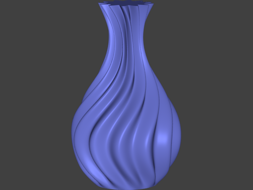
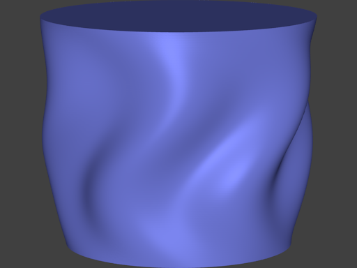
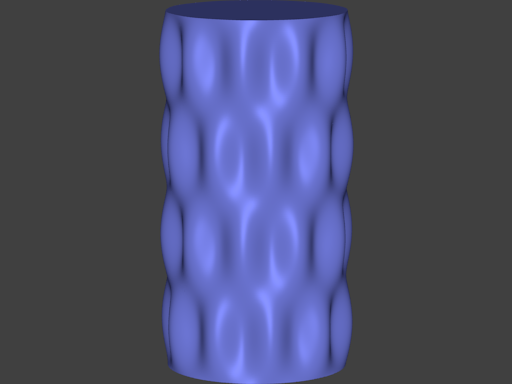

# Spiral Vase (this is a fixed version of the original script from Karim Kanso to work with Blender 2.8 and newer)

Python script for Blender to generate spiral vase models that can be
exported for use with 3D printers. All vases are heavily based on
sinusoidal functions.

## Examples

A number of example shapes are provided, and are defined in the
`examples` file. Use the `generate.py` script to generate the PNG and
STL files.

The following command will read the `examples` file and put the STL
files into a directly called `stl` directory and put the PNG files in
to a directory called `png`.

```bash

generate.py --stl-dir stl --png-dir png examples

```

The examples file contains a JSON representation of command line
arguments for the sincircle.py script (see below).

### Spiral Vase



### Tumbler



### Ripple Column



## Usage

```bash

# Run with default values
blender --python sincircle.py

# Print help
blender --python sincircle.py -- +h

usage: blender --python sincircle.py --
       [+h] [++outputstl S] [++outputpng S] [++close] [++slices I]
       [++slice-height F] [++slice-samples I] [++vase-radius F]
       [++slice-scale-wave F F F] [++slice-rotate-wave F F F]
       [++slice-wave-amplitude F] [++slice-wave-frequency I]
       [++slice-wave-magnitude-wave I I I]

Generate Blender models that are based on repeated extrusion, scaling and
rotation of a circle. All transformation heavily rely on sinusoids, and as a
result can produce a range of vase-like objects that are capable of being 3D
printed. To avoid clash with Blender, the argument prefix char is changed from
'-' to '+'.

optional arguments:
  +h, ++help            show this help message and exit
  ++outputstl S         Output stl file name. [type: str, default: none]
  ++outputpng S         Output png file name. [type: str, default: none]
  ++close               Close Blender when finished.
  ++slices I            Number of slices (or layers) generated in the model.
                        [type: int, default: 200]
  ++slice-height F      Height of each slice. [type: float, default: 0.2]
  ++slice-samples I     Number of samples taken on the edge of each slice.
                        [type: int, default: 800]
  ++vase-radius F       Base radius of each slice before scalling is applied.
                        [type: float, default: 7]
  ++slice-scale-wave F F F
                        Controls the scaling of each slice, when set to [0 0
                        1] no scaling is performed. The slice scaling is
                        calculated by a sine wave running vertically, where
                        the first and second arguments are used to linearly
                        interpolate (for each slice) a value in the domain of
                        the sine function (in degrees). The final argument
                        defines the amplitude of the sine wave. [type: float,
                        default: [0, 335, 0.6]]
  ++slice-rotate-wave F F F
                        Controls the rotation of each slice, when set to [0 0
                        1] no rotation is performed. The slice rotation is
                        calculated by a sine wave running vertically, where
                        the first and second arguments are used to linearly
                        interpolate (for each slice) a value in the domain of
                        the sine function (in degrees). The final argument
                        defines the amplitude of the sine wave. [type: float,
                        default: [0, 360, 30]]
  ++slice-wave-amplitude F
                        Each slice starts as a circle, and then has its edge
                        transformed into a sine wave. This value sets the
                        amplitude of the sine wave. To have each slice remain
                        as a circle, set this value to 0. [type: float,
                        default: 1]
  ++slice-wave-frequency I
                        Each slice starts as a circle, and then has its edge
                        transformed into a sine wave. This value sets the
                        number of resulting sine waves. Only complete waves
                        are supported, thus this value must be an integer.
                        [type: int, default: 12]
  ++slice-wave-magnitude-wave I I I
                        Controls the magnitude of the sine wave applied on
                        each slice by running a second vertical sine wave,
                        that is multiplied against the wave on the edge of
                        each slice. This can be used to create a bumpy texture
                        on the vase or chamfer the base/top. The first two
                        parameters define the start and stop of the sine wave.
                        E.g. values of [0, 180, slices] would result in a
                        round top and bottom with the ridges graduated in and
                        out. The final parameter is a cut-off (in layers), so
                        that its possible to chamfer the base of the base into
                        a circle, i.e. the default value of [0,90,20] will
                        start the base with a round circle (as the first value
                        is sin(0)=0) and over the subsequent 20 layers
                        graduate to the maximum ridges as sin(90)=1. [type:
                        float, default: [0, 90, 20]]
```
